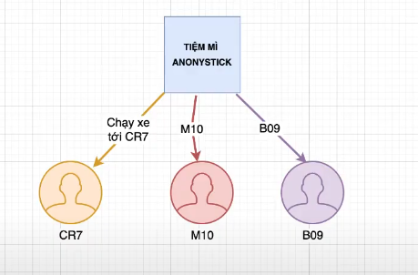
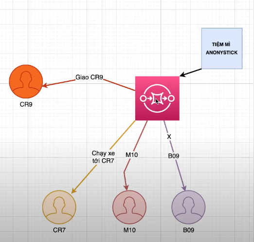
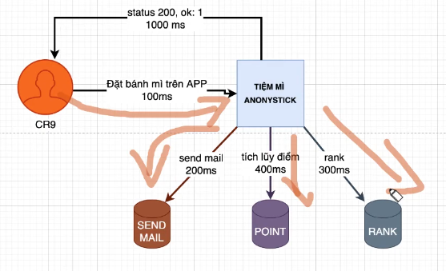
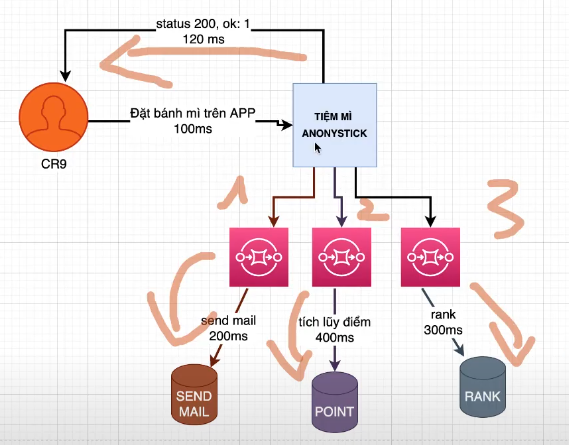
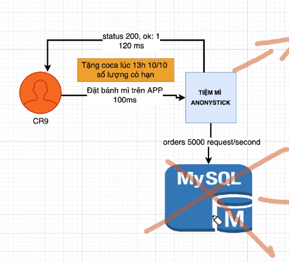
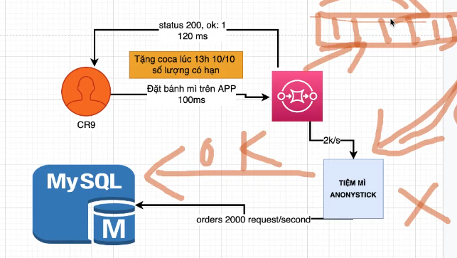
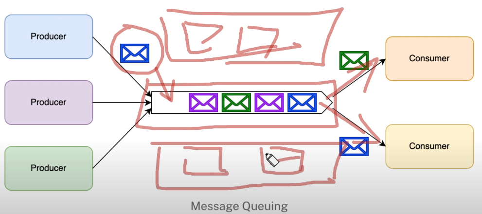
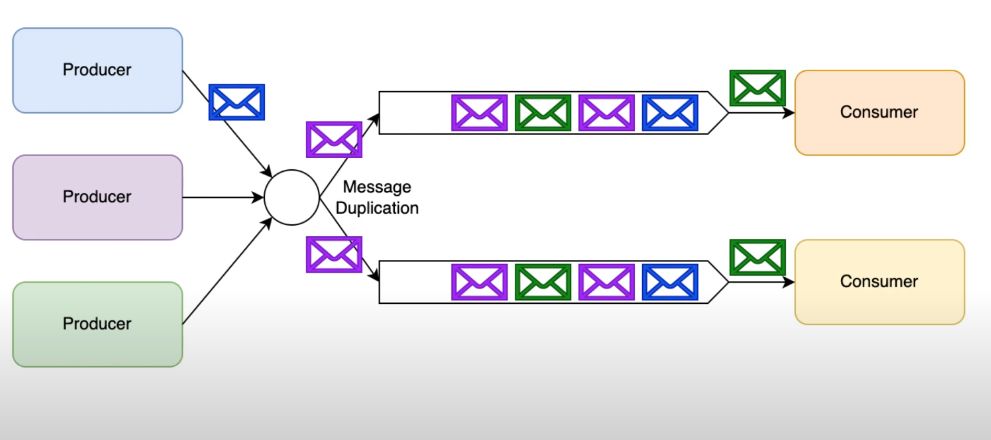
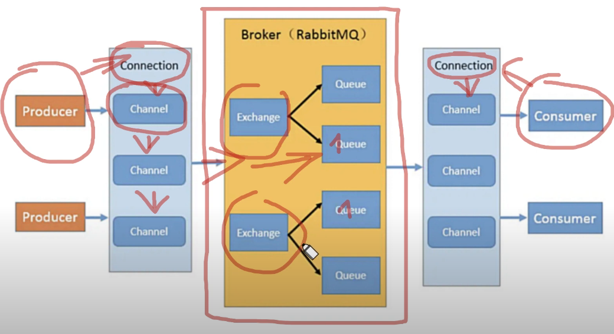

# Learn RabbitMQ
## Bài 1
### 3 câu hỏi
1. Tại sao dùng MQ
2. Ưu điểm và nhược điểm
3. RabbitMQ, RockerMQ và Kfka -> khi nào dùng cái nào?
### Câu hỏi 1: Tại sao phải dùng?
- Tách ra trong hệ thống microservice:
    + Khi không dùng:

    + Khi dùng:

- Hệ thống không đòngo bộ, tối ưu tốc độ truy vấn
    + Khi không dùng:
    
    + Khi dùng:
    
- Tối ưu lại lượng request từ client thông qua message queue
    + Khi không dùng:    

    + Khi dùng:


### Câu hỏi 2: Nhược điểm
- Tăng độ phức tạp của hệ thống.
- Bị miss message
- Tính nhất quán của hệ thống (Cơ sở dữ liệu của mysql có khi lại khác của rabbitMQ).

### Câu hỏi 3: Hai Message Queue phổ biến: Kfka và RabbitMQ
- Thông lượng RabbitMQ tầm 10000 < Kfka
- Tính khả dụng của RabbitMQ rất cao, có kiến trúc phân tán, còn Kfka còn cao hơn nó nữa, độ phân tán, ít mất dữ liệu hơn RB, 
- Tin nhắn có đáng tin cậy không thì Kfka lại rất cao, về cơ bản có mất. Còn RB thì lại không mất.
- Tốc độ: RB tính ở < milisecond, còn Kfka ở mức milisecond.

## Bài 2 Giới thiệu về Publish/Subcribe và Queue
- Chế độ ngang hàng

- Chế độ Pub/sub


### Cách thức hoạt động


Hoạt động: 1 service producer muốn làm việc thì bước đầu phải connect vào 1 channel (tạo channel), và consumer muốn nhận data thì cũng phải kết nối với connection channel. Còn ở phía máy chủ, sau khi gửi message vào, nếu không có exchange thì nó sẽ đi thẳng vào queue luôn, nếu có thì sẽ dc định tuyến qua queue dc định nghĩa ở exchange, Exchange thì có 4 loại (**Fanout, Direct, Topic và Headers**) 
## Bài 3
### 1. noAck
- Nếu nó là **false** thì khi bên nhận message sẽ chỉ nhận và không xác nhận là đã nhận, và khi server tắt và khỏi động lại thì message đó vẫn gửi lại, => nên để **true** -> nhận rồi thì bên message queue sẽ biết mà xóa luôn
    ```Javascript
    //5. receive to queue
    await channel.consume(nameQueue, msg => {
        console.log(`MSG::::`, msg.content.toString())
    }, {
        noAck: true
    })
    ```
### 2. TTL
- Thời gian sống của message được gửi lên
    ```Javascript
    //5. send to queue
    await channel.sendToQueue(nameQueue, Buffer.from(msg), {
        expiration: '20000', //TTL -> time to live
    })
    ```
### 3. durable
- Nếu lỡ không may restart lại server thì nếu **durable=true** thì nó sẽ không mất message, và ngược lại.
    ```Javascript
    //4. create queue (cả producer và consumer đều có)
    await channel.assertQueue(nameQueue, {
        durable: true
    })
    ```
### 4. persistent
- Message sẽ sử lý liên tục
- Được lưu vào **ổ đĩa hoặc cache**, (**nếu cache có vấn đề thì sẽ lấy ở ổ đĩa ra chạy**)
    ```Javascript
    //5. send to queue
    await channel.sendToQueue(nameQueue, Buffer.from(msg), {
        persistent: true
    })
    ```

## Bài 4: exchange route
- Exchange rouute nằm giữa route và producer giúp binding msg về đúng route theo ý mình.
- Có 4 loại là header, topic, fanout, direct -> bài này học về fanout
- Trong queue có 1 options là `exclusive: true` thì nếu ngắt kết nối queue thì queue sẽ tự xóa, tránh lãng phí.